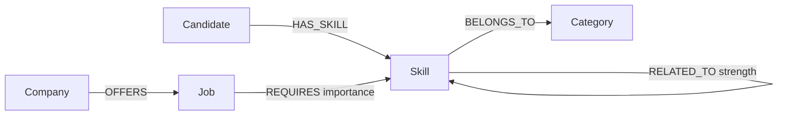

# SkillGraph

SkillGraph is a graph-backed job recommendation app built for the Wexa AI take-home assignment. It helps a candidate understand which jobs match their current skills, which skills are missing, and why a role is recommended.

Candidate: Devesh Yadav  
Email: deveshyadav7113@gmail.com

## Why A Graph Database?

SkillGraph is relationship-heavy. The useful questions are not only about jobs or skills individually; they are about paths such as:

`Candidate -> HAS_SKILL -> Skill -> RELATED_TO -> Skill <- REQUIRES <- Job <- OFFERS - Company`

A relational database can model this, but the most interesting queries become join-heavy and harder to explain. CognoDB lets the app traverse skills, related technologies, jobs, and companies directly with Cypher, which makes recommendations and "why this job?" explanations natural.

## Data Model



### Nodes

- `Candidate`: person whose skills are evaluated.
- `Skill`: technology, tool, or practice.
- `Job`: role being recommended.
- `Company`: company offering a job.
- `Category`: skill family such as Backend, Frontend, Cloud, Data, AI, or DevOps.

### Relationships

- `(:Candidate)-[:HAS_SKILL]->(:Skill)`
- `(:Job)-[:REQUIRES { importance }]->(:Skill)`
- `(:Company)-[:OFFERS]->(:Job)`
- `(:Skill)-[:RELATED_TO { strength }]->(:Skill)`
- `(:Skill)-[:BELONGS_TO]->(:Category)`

## Main Features

- Candidate dashboard with skill summary and top matches.
- Ranked job recommendations with match percentage.
- Job detail view with matched skills, missing skills, and company context.
- "Why this job?" traversal that shows the graph path behind a recommendation.
- Add/remove candidate skills and refresh recommendations live.
- Add a new job for an existing company with required skills.
- Graceful database error state if CognoDB is unreachable.

## Tech Stack

- React + Vite frontend
- Node.js + Express backend
- CognoDB over Bolt using the official Neo4j JavaScript driver

## Local Setup

### 1. Create CognoDB Instance

1. Go to `https://console.cognodb.com/signup`.
2. Create a free `c0` instance.
3. Save the generated password immediately.
4. Use the Bolt URI, username, and password as environment variables.

### 2. Configure Backend

Copy `server/.env.example` to `server/.env`.

```bash
COGNODB_URI=bolt+s://your-instance.databases.cognodb.com
COGNODB_USERNAME=cognodb
COGNODB_PASSWORD=your-password
PORT=4000
CLIENT_ORIGIN=http://localhost:5173
```

### 3. Install Dependencies

```bash
npm run install:all
```

### 4. Seed The Graph

```bash
npm run seed
```

### 5. Run The App

```bash
npm run dev
```

Frontend: `http://localhost:5173`  
Backend health: `http://localhost:4000/api/health`

## Important Cypher Queries

### Job Recommendations

Find jobs connected to a candidate's existing skills and score them by required skills matched.

```cypher
MATCH (candidate:Candidate {id: $candidateId})-[:HAS_SKILL]->(skill:Skill)
MATCH (job:Job)-[:REQUIRES]->(required:Skill)
WITH candidate, job, collect(DISTINCT required) AS requiredSkills, collect(DISTINCT skill) AS candidateSkills
WITH job, requiredSkills, [s IN requiredSkills WHERE s IN candidateSkills] AS matchedSkills
MATCH (company:Company)-[:OFFERS]->(job)
RETURN job, company, matchedSkills, requiredSkills
ORDER BY size(matchedSkills) DESC
```

### Missing Skills

Find required skills for a job that a candidate does not have.

```cypher
MATCH (job:Job {id: $jobId})-[:REQUIRES]->(required:Skill)
WHERE NOT EXISTS {
  MATCH (:Candidate {id: $candidateId})-[:HAS_SKILL]->(required)
}
RETURN required
```

### Multi-Hop "Why This Job?"

Show a graph-friendly traversal that explains a recommendation through direct and related skills.

```cypher
MATCH path = (candidate:Candidate {id: $candidateId})-[:HAS_SKILL]->(:Skill)-[:RELATED_TO*0..1]->(:Skill)<-[:REQUIRES]-(job:Job {id: $jobId})<-[:OFFERS]-(company:Company)
RETURN path
LIMIT 8
```

This is the strongest graph-specific feature because it explains a recommendation as a relationship path rather than a flat score.

## Deployment

Recommended deployment:

- Backend: Render Web Service
- Frontend: Vercel

Set these backend environment variables on Render:

- `COGNODB_URI`
- `COGNODB_USERNAME`
- `COGNODB_PASSWORD`
- `CLIENT_ORIGIN`

Set this frontend environment variable on Vercel:

- `VITE_API_BASE_URL`

## Demo Script

1. Open Devesh's dashboard and show current skills.
2. Open recommendations and show ranked jobs.
3. Select a job and explain match percentage.
4. Show matched and missing skills.
5. Open "Why this job?" and walk through the graph path.

## Screenshots

Add screenshots here after deployment:

- Dashboard
- Recommendations
- Job detail / graph path
